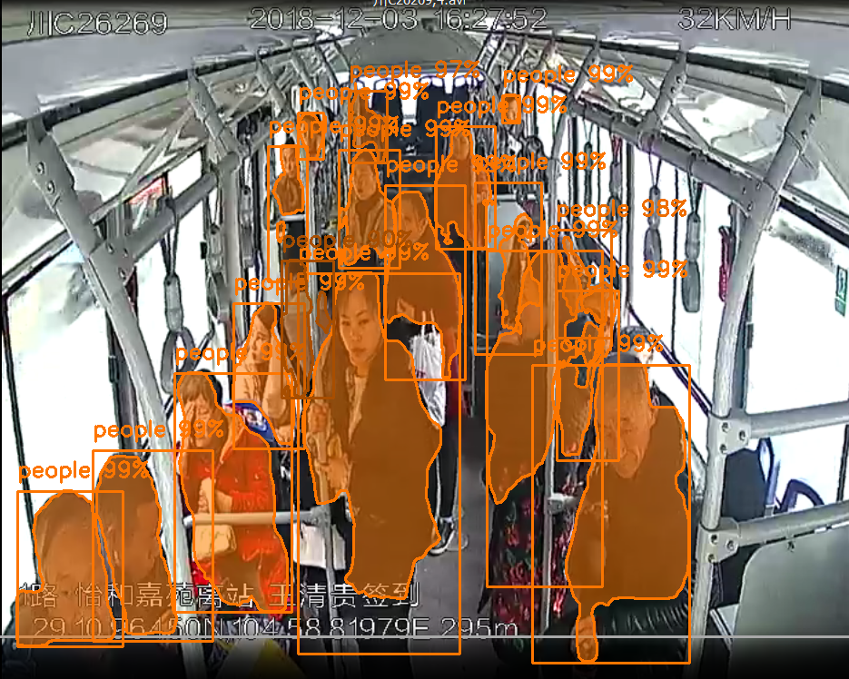
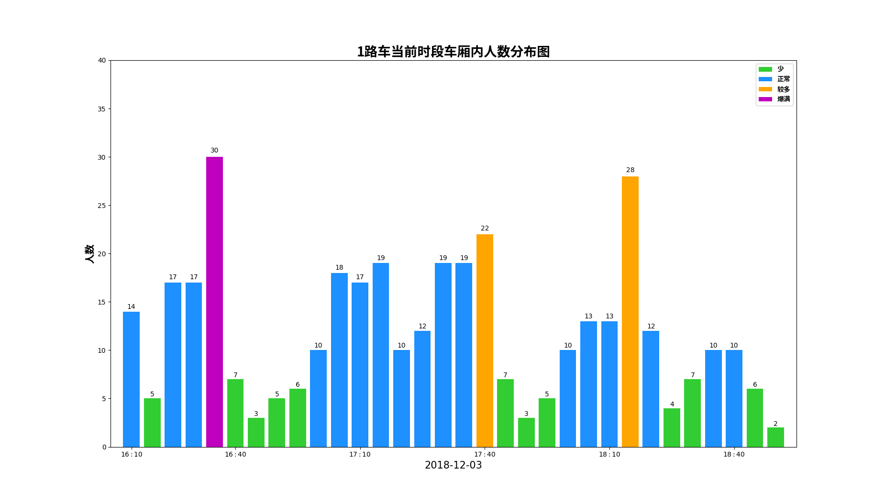

# 公交车中的人数统计及安全检测

使用Mask_RCNN来对公交车中的人数和异常状况进行检测

## 快速开始

1. 根据./requirements.txt安装所需的环境

2. 在[release](<https://github.com/sunnyswag/detect_num_of_people/releases>)中下载权重文件和数据集至本地
3. 使用./people/people.py进行预测或训练

## One more thing

1. [./cv_screenshoot.py](./cv_screenshoot.py)：截取视频帧所用的脚本

2. 在对视频进行检测后所画的柱状图：

   

